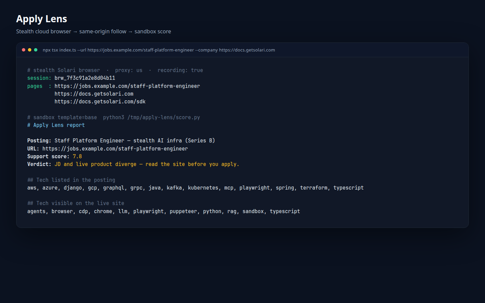
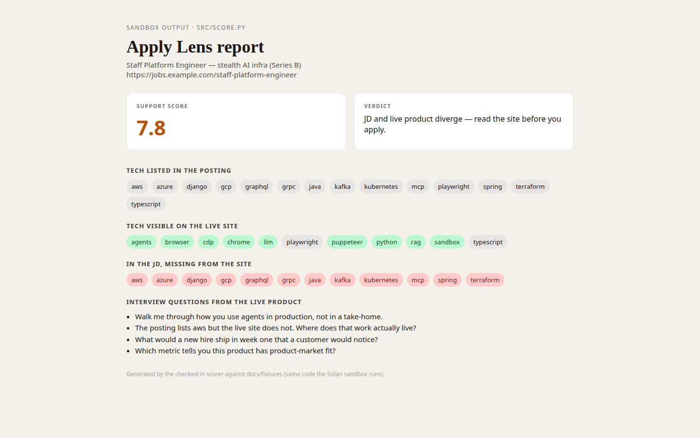
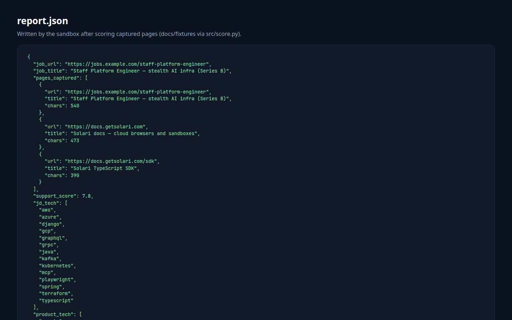

# Apply Lens

[](https://github.com/mangeshraut712/apply-lens/actions/workflows/ci.yml)
[](https://www.typescriptlang.org/)
[](https://www.python.org/)
[](https://docs.getsolari.com)
[](LICENSE)

Job postings are marketing. The live product is the evidence.

**Demo:** this is a CLI — [run it locally](#run). There is no separate GitHub Pages site; the homepage is this README.

Apply Lens opens a **stealth Solari cloud browser** (residential US egress, session recording), reads a posting the way a candidate would, follows a few same-origin product/docs links, then scores the JD against that capture inside a **Solari sandbox**. The report tells you what the company actually ships, which JD skills never appear on the site, and interview questions grounded in the live pages.

Built for the [Pinetree / Solari SWE intern challenge](https://x.com/harrychow_/status/2094437473912844480) by [Mangesh Raut](https://mangeshraut712.github.io/mangeshrautarchive/).



<p>

&nbsp;

</p>

<sub>Screenshots from a real <code>src/score.py</code> run against <a href="docs/fixtures/">docs/fixtures</a> (the same scorer the Solari sandbox executes). Replay with <code>npm run score:fixtures</code> — no API key required.</sub>

## Why this, not a resume

People waste weeks applying to roles whose public product does not match the posting. I wanted something I would use this week: paste a URL, get a truth report, decide whether to apply.

Harry asked for a use case people truly need. This is that.

## What Solari is doing here

| Piece | Why a laptop browser is not enough |
| --- | --- |
| `@solarisdk/browser` stealth + `proxy: "us"` | Careers and docs sites often treat datacenter crawlers differently than a person at home |
| Session recording | Replay the exact pages the score was built from |
| `@solarisdk/sdk` sandbox | Untrusted scoring code and captured pages stay off your machine |

Cookbook fork: https://github.com/mangeshraut712/solari-cookbook

## Run

```bash
# key from https://console.getsolari.com  (docs: http://docs.getsolari.com)
export SOLARI_API_KEY=slr_live_...

npm install
npx tsx index.ts --url https://docs.getsolari.com
```

If the posting is on a job board and the product is elsewhere:

```bash
npx tsx index.ts --url 'https://job-board.example/role' --company https://docs.getsolari.com
```

Score the checked-in fixtures without Solari (same Python the sandbox runs):

```bash
npm run score:fixtures
```

## Output

- Support score: token overlap between the posting and live pages
- Tech in the JD vs tech on the site
- Skills listed in the posting that never appear on the product
- Interview questions derived from the live site, not from the JD template

## Stack

TypeScript, Playwright-compatible Solari browsers, Python 3 in a Solari microVM.
